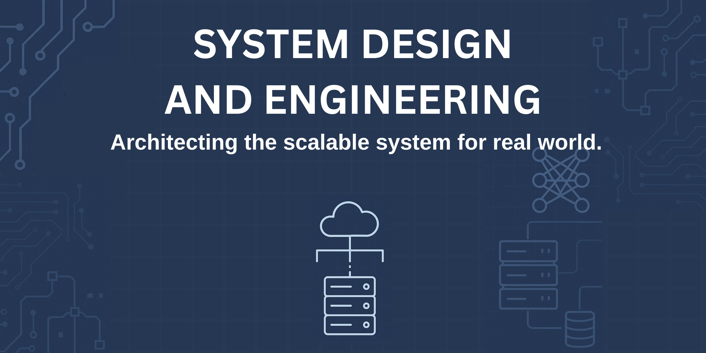

# Welcome System Design and Engineering (HCAI5CS001)
{ align=center }

This course equips students with the theoretical foundations and applied practices in system design and engineering. It covers concepts essential for building scalable, fault-tolerant, data-intensive, and production-ready applications. Emphasis is placed on distributed systems design, cloud-native architectures, and data engineering strategies, drawing on seminal works and real-world industry practices.

## Register for the Course
Registration is not yet open.

You will be notified via email from the PAT office or College Administration once registration begins.

After registration opens, you will be able to enroll by clicking the registration button on this page or using the link that will be shared.

[Register Here](#)

